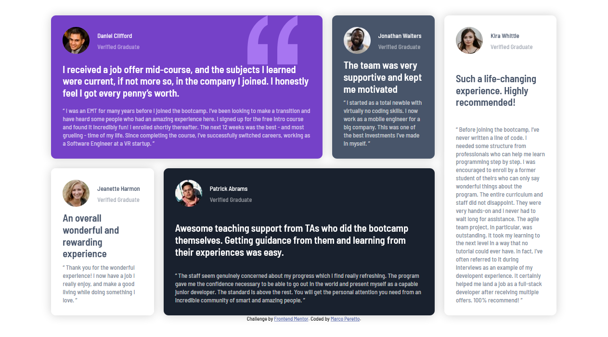

# Frontend Mentor - Testimonials grid section solution

This is a solution to the [Testimonials grid section challenge on Frontend Mentor](https://www.frontendmentor.io/challenges/testimonials-grid-section-Nnw6J7Un7). Frontend Mentor challenges help you improve your coding skills by building realistic projects. 

## Table of contents

- [Overview](#overview)
  - [The challenge](#the-challenge)
  - [Screenshot](#screenshot)
  - [Links](#links)
- [My process](#my-process)
  - [Built with](#built-with)
  - [What I learned](#what-i-learned)
  - [Useful resources](#useful-resources)
- [Author](#author)

## Overview

### The challenge

Users should be able to:

- View the optimal layout for the site depending on their device's screen size

### Screenshot
Desktop version:


Mobile version:


### Links

- Solution URL: [Solution](https://www.frontendmentor.io/solutions/testimonials-section-using-sass-and-css-grid-and-flex-Tk9_n7uwN)
- Live Site URL: [Live site](https://testimonial-grid-section-challenge.netlify.app/)

## My process

### Built with

- Semantic HTML5 markup
- CSS custom properties
- Flexbox
- CSS Grid
- Mobile-first workflow

### What I learned

Grid Areas:
```css
section.testimonials {
    display: grid;
    grid-gap: 20px;
    grid-template-columns: repeat(9, 1fr);
    grid-template-rows: repeat(2, auto);
    grid-template-areas: 
    "d d d d d j j k k k"
    "je je p p p p p k k k";
}
```

### Useful resources

- [CSS Flex Guide](https://css-tricks.com/snippets/css/a-guide-to-flexbox/)
- [CSS Grid Guide](https://css-tricks.com/snippets/css/complete-guide-grid/)

## Author

- Frontend Mentor - [@mperetto](https://www.frontendmentor.io/profile/mperetto)
- Linkedin - [Marco Peretto](https://www.linkedin.com/in/marco-peretto/)
